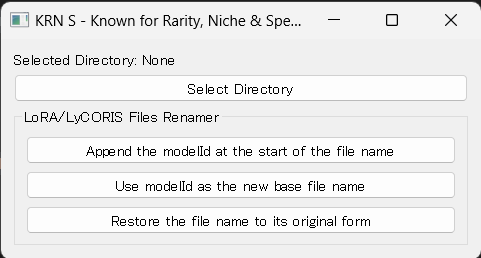

# KRNS LoRA/LyCORIS file renamer | KRNS LoRA/LyCORIS ファイルリネーマー

KRNS - Known for Rarity, Niche &amp; Specialized

日本語の説明は[下の方](https://github.com/kai-rin/KRNS#%E6%A6%82%E8%A6%81)にあります



## Overview
Created to bring order to the perpetually cluttered LoRA/LyCORIS storage directories of Stable Diffusion and the rather chaotic file names downloaded from Civitai. KRNS LoRA/LyCORIS File Renamer is a tool with a GUI, built using Python and PyQt5, for batch renaming LoRA/LyCORIS files.

## Features
Directory Selection
Click Select Directory to choose the directory where your LoRA/LyCORIS files are stored.

## LoRA/LyCORIS File Renamer

1. **Add Model ID at the Beginning of File Names**: For instance, changes `AwyHandHeartXL.safetensors` to `126227_AwyHandHeartXL.safetensors`. The `126227` here is the same number that appears in the URL when you open a model page on Civitai. The same number will be added even for different versions of LoRA/LyCORIS files from the same model page.

2. **Use Model ID as the New Base File Name**: Simplifies `AwyHandHeartXL.safetensors` to `126227.safetensors`. For different versions of LoRA/LyCORIS files from the same model page, they will be converted to the same number, which may not be ideal (might improve this later).

3. **Revert File Names**: If you mistakenly click the button to add the model ID to the file name multiple times, don't worry. This button will revert the names to the original as recorded in the `.civitai.info` file.

## How to Run

### Method 1: For those familiar with Python. Clone this repository, install PyQt5, and execute KRNS-renamer.py
Execute the following commands one line at a time:

``` bash
pip install PyQt5
git clone https://github.com/kai-rin/KRNS.git
cd .\KRNS\
python KRNS-renamer-alpha.py
```

### Method 2: For those who don't want to mess with the command line in a Windows environment. Download and execute the .exe file
Release Page: https://github.com/kai-rin/KRNS/releases

KRNS-renamer-hogehoge.exe is simply created using pyinstaller --onefile --noconsole --icon=KRNS-renamer-alpha.ico KRNS-renamer-alpha.py.

### Mechanics
The program processes each directory and sub-directory to find .civitai.info files. It then uses the modelId and the original file name recorded in these files to rename the files.

### Contributions
If you have better ideas or find bugs, feel free to fork the repository, make a little tweak, and send a pull request. The author has a rather laid-back approach to software development, so all contributions are welcome and will likely bring great joy.

### License
Published in accordance with PyQt5's licensing policy under the GNU General Public License v3.0 (GPLv3).

Reference: https://www.gnu.org/licenses/gpl-3.0.en.html

## 概要

Stable DiffusionのLoRA/LyCORIS保管ディレクトリが永遠にごちゃごちゃしてる&Civitaiからダウンロードするファイル名がわりと無秩序なので作りました。KRNS LoRA/LyCORIS ファイルリネーマーはPythonとPyQt5で作られた、LoRA/LyCORISファイルを一括でリネームするGUIを持つツールです。

## 機能

### ディレクトリ選択

`Select Directory`をクリックして、LoRA/LyCORISがたまってるディレクトリを選びましょう。

### LoRA/LyCORIS ファイルリネーマー

1. **モデルIDをファイル名の先頭に追加**: たとえば `AwyHandHeartXL.safetensors` を `126227_AwyHandHeartXL.safetensors` に変えます。 ここの `126227` はCivitaiのモデルページを開いたときにURLに表示されている数字と同一です。同じモデルページのバージョン違いのLoRA/LyCORISの場合でも、同じ番号を付与してしまいます。

2. **モデルIDを新しい基本ファイル名として使用**: `AwyHandHeartXL.safetensors` をシンプルに `126227.safetensors` にします。同じモデルページのバージョン違いのLoRA/LyCORISの場合、同じ番号に変換してしまいます。あんまりよろしくないですね！（そのうち改良するかも。）

3. **ファイル名を元に戻す**: モデルIDをファイル名の先頭に追加ボタンを連打するなどのうっかりミスも安心、このボタンで`.civitai.info`ファイルに記録された元の名前に戻します。

## 実行方法

### 方法1: Pythonを扱えるひと向け。このリポジトリをクローンして、PyQt5をインストールして、`KRNS-renamer.py` を実行

以下のコマンドを１行ずつ実行してください。

```bash
pip install PyQt5
git clone https://github.com/kai-rin/KRNS.git
cd .\KRNS\
python KRNS-renamer-alpha.py
```

### 方法2: Windows環境でいちいちコマンドライン叩きたくないひと向け。 exe実行ファイルをダウンロードして、ダブルクリックやエンターで実行

リリースページ: <https://github.com/kai-rin/KRNS/releases>

`KRNS-renamer-hogehoge.exe` はシンプルに `pyinstaller --onefile --noconsole --icon=KRNS-renamer-alpha.ico KRNS-renamer-alpha.py` で作成しただけのものです。

## 仕組み

プログラムは各ディレクトリとサブディレクトリを処理して、`.civitai.info` ファイルを探します。このファイルに記述されている `modelId` や元のファイル名を使って、ファイル名を変更します

## コントリビューション

より良いアイデアあったりバグ見つけた人、めちゃくちゃ気軽にフォークして、ちょこっといじって、プルリクエスト送ってください。作者はソフトウェア開発能力いい加減なので、なんでもウェルカムだしたぶんめちゃくちゃ喜びます。

## ライセンス

PyQt5のライセンスポリシーにのっとり GNU General Public License v3.0（GPLv3）で公開してます。

参考: <https://www.gnu.org/licenses/gpl-3.0.en.html>
